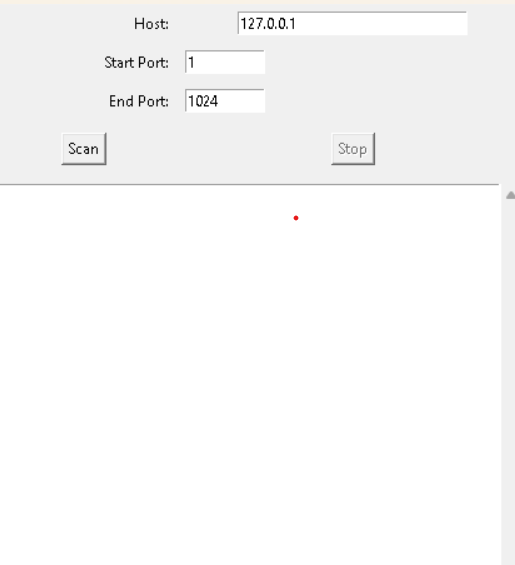

# Simple Port Scanner

A basic port scanner built with Python and a graphical user interface (GUI) using Tkinter.  
It allows you to scan a range of ports on a target host to identify which ports are open or closed.



---

## Features

- Scan any host (IP address or domain) within a specified port range.
- Real-time display of open and closed ports.
- Start and Stop scanning controls.
- Responsive GUI interface using Tkinter.
- Runs on Python 3 with no extra dependencies.

---

## Requirements

- Python 3.x (Recommended 3.7 or higher)
- Tkinter (Usually included with standard Python installations)

---

## Installation

1. Clone the repository or download the source code.
2. Make sure Python 3 and Tkinter are installed on your system.
3. No additional packages are needed.

---

## Usage

1. Open a terminal or command prompt.
2. Navigate to the directory containing `port_scanner_gui.py`.
3. Run the script:

    ```bash
    python port_scanner_gui.py
    ```

4. In the GUI window:
    - Enter the target host (IP address or domain name).
    - Enter the start and end port numbers to scan.
    - Click **Scan** to begin scanning.
    - Click **Stop** to halt an ongoing scan.

---

## Example

- **Host:** `127.0.0.1`
- **Start Port:** `1`
- **End Port:** `1024`

The application will display the status of each port in the specified range.

---

## Important Notes

- Scanning a large range of ports can take time depending on network conditions.
- Always have permission to scan remote hosts to avoid legal issues.
- Use this tool responsibly.

---

## License

This project is open-source and available under the MIT License.

---

## Contact

For any questions or suggestions, feel free to reach out.

